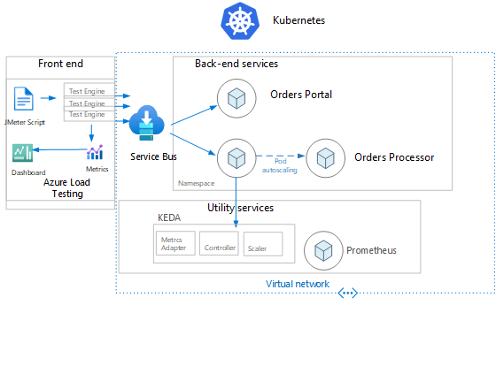

# Welcome to: Module 2: Application Deployment and Testing with Azure Load Testing
The output of this lab be this diagram:


### Install KEDA

* Execute the following

```

rg_name=[name of rg created in module 1]
akscluster_name=[name of aks cluster created in module 1]


helm repo add kedacore https://kedacore.github.io/charts
helm repo update

az aks get-credentials --admin -g $rg_name --name $akscluster_name

kubectl create namespace keda
helm install keda kedacore/keda --namespace keda
```

### Creating a new Azure Service Bus namespace & queue

* Execute the following

```cli
project_name=servicebus
servicebus_namespace=$project_name

```
> Need to discuss if we still need the following since it should be included already in Module 1 
az servicebus namespace create --name $servicebus_namespace -g $rg_name --sku basic

queue_name=orders
az servicebus queue create -g $rg_name --namespace-name $servicebus_namespace --name $queue_name
```
authorization_rule_name=order-consumer
az servicebus queue authorization-rule create -g $rg_name --namespace-name $servicebus_namespace --queue-name $queue_name --name $authorization_rule_name --rights Listen

queue_connection_string=$(az servicebus queue authorization-rule keys list -g $rg_name --namespace-name $servicebus_namespace --queue-name $queue_name --name $authorization_rule_name --query primaryConnectionString -o tsv)

demo_app_namespace=order-processor
kubectl create namespace $demo_app_namespace

monitor_authorization_rule_name=order-monitor
az servicebus queue authorization-rule create -g $rg_name --namespace-name $servicebus_namespace --queue-name $queue_name --name $monitor_authorization_rule_name --rights Manage Send Listen

monitor_connection_string=$(az servicebus queue authorization-rule keys list -g $rg_name --namespace-name $servicebus_namespace --queue-name $queue_name --name $monitor_authorization_rule_name --query primaryConnectionString -o tsv)

keda_servicebus_secret=keda-servicebus-secret
kubectl create secret generic $keda_servicebus_secret --from-literal=keda-connection-string=$monitor_connection_string -n $demo_app_namespace

kubectl create secret generic order-consumer-secret --from-literal=queue-connection-string=$queue_connection_string -n $demo_app_namespace

demo_web_namespace=order-portal
kubectl create namespace $demo_web_namespace

kubectl create secret generic order-consumer-secret --from-literal=queue-connection-string=$monitor_connection_string -n $demo_web_namespace


```

### Deploying order processor app

* Execute the following

```cli
cd [file path to module2]
kubectl apply -f deploy/deploy-app.yaml --namespace $demo_app_namespace

kubectl apply -f deploy/deploy-autoscaling.yaml --namespace $demo_app_namespace

kubectl get hpa -n $demo_app_namespace -o wide 

--Take a look at the HPA state before proceeding to the next step.

```
* Alternative the following:

```
kubectl apply -f https://raw.githubusercontent.com/Azure/aks-advanced-autoscaling/module2/docs/module2/deploy/deploy-app.yaml -n $demo_app_namespace

kubectl apply -f https://raw.githubusercontent.com/Azure/aks-advanced-autoscaling/module2/docs/module2/deploy/deploy-autoscaling.yaml -n $demo_app_namespace

kubectl get hpa -n $demo_app_namespace -o wide 

--Take a look at the HPA state before proceeding to the next step.

```
### Deploying Keda scaledobject

* Execute the following

```cli

kubectl describe scaledobject order-processor-scaler -n $demo_app_namespace

kubectl get deployments --namespace $demo_app_namespace -o wide

```

### Deploying web order portal

* Execute the following
```
cd [file path to module2]
kubectl apply -f deploy/deploy-web.yaml --namespace $demo_web_namespace

kubectl get pod -n $demo_web_namespace -w 

--Wait for the pod to be in Running state before proceeding to the next step.

```

* Alternative the following:

```
kubectl apply -f https://raw.githubusercontent.com/Azure/aks-advanced-autoscaling/module2/docs/module2/deploy/deploy-web.yaml -n $demo_web_namespace

kubectl get pod -n $demo_web_namespace -w 

--Wait for the pod to be in Running state before proceeding to the next step.

```

### Optional and to be replace by ALT configuration 

#### Setting up and running service bus

* Execute the following

```cli

monitor_authorization_rule_name=keda-monitor-send
az servicebus queue authorization-rule create --namespace-name $servicebus_namespace --queue-name $queue_name --name $monitor_authorization_rule_name --rights Listen Send

MONITOR_CONNECTION_STRING=$(az servicebus queue authorization-rule keys list --namespace-name $servicebus_namespace --queue-name $queue_name --name $monitor_authorization_rule_name --query primaryConnectionString -o tsv)

echo $MONITOR_CONNECTION_STRING 
```
#### Publishing messages to the queue

https://github.com/kedacore/sample-dotnet-worker-servicebus-queue/blob/main/connection-string-scenario.md#publishing-messages-to-the-queue

#### Watching the pods scale

* In the bash shell: run `watch kubectl get pod -n $demo_app_namespace -w`

### Retrieve Shared Access Key with proper string formatting/encoding

Open (or reuse) a bash/sh shell.

#### Retrieve the Azure Service Bus Namespace (ASB) ConnectionString using shell

#### Step 1 - Retrieve the Azure Service Bus Namespace (ASB) ConnectionString using shell

Login to Azure by running the 'az login' command below from an active Cloud (or Git) bash/sh shell.
> Note - the command will open a browser window to let you authenticate to Azure. </br>If you are already logged in you can skip the command 'az login'.
```
az login
```
Set the value of the subscription id containing the Azure Service Bus Namespace previously created. It is basically the one used for this entire exercise.
> Note: If you don't know the id/guid of the subscription, please run "az account list" and identify the id in the list returned by the command.    
```
subscription=[your subscription id]
```
The next command will set the azure subscription context - please just copy, paste, run:
```
az account set -s $subscription 
```
Set the values of: resource group and azure service bus namespace. If done already you can skip the next 2 lines
```
rg_name=[name of rg created in module 1]
servicebus_namespace=[name of your azure service bus namespace]  
```
Here we'll use some static values of components previously created for Azure Service Bus. No need to change anything.
Please just copy, paste, run until the end of the script 
```
asb_queue=orders 
asb_queue_key_name=keda-monitor-send

asb_uri="https://"$servicebus_namespace".servicebus.windows.net/"$asb_queue"/messages"
asb_queue_primary_key=$(az servicebus queue authorization-rule keys list -g $rg_name --namespace-name $servicebus_namespace --queue-name $queue_name --name $asb_queue_key_name --query primaryKey -o tsv)
echo $asb_queue_primary_key

get_sas_token() {
    local ASB_URI=$1
    local SHARED_ACCESS_KEY_NAME=$2
    local SHARED_ACCESS_KEY=$3
    local EXPIRY=${EXPIRY:=$((60 * 60 * 8))} # Setting default token expiration at 8 hours

    local ENCODED_URI=$(echo -n $ASB_URI | jq -s -R -r @uri)
    local TTL=$(($(date +%s) + $EXPIRY))
    local UTF8_SIGNATURE=$(printf "%s\n%s" $ENCODED_URI $TTL | iconv -t UTF-8)

    local HASH=$(echo -n "$UTF8_SIGNATURE" | openssl sha256 -hmac $SHARED_ACCESS_KEY -binary | base64)
    local ENCODED_HASH=$(echo -n $HASH | jq -s -R -r @uri)

    echo -n "SharedAccessSignature sr=$ENCODED_URI&sig=$ENCODED_HASH&se=$TTL&skn=$SHARED_ACCESS_KEY_NAME"
}

sastoken=$(get_sas_token $asb_uri $asb_queue_key_name $asb_queue_primary_key)
echo $sastoken
```
You will use the value of $sastoken to configure a secret in Azure Key Vault. </br>
That secret will be used by the Azure Load Testing Test Run to connect to your Azure Service Bus service endpoint. More information later in this module.


### Set the Azure Service Bus SharedAccessKey in an Azure Key Vault Secret

```
# Set the value here with the $sastoken value coming from previous section.  
secretvalue="[SharedAccessSignature sr=https%3a%2f%2fyourasb.servicebus.windows.net]"

## Set subscription id. If already set, you can skip the command. 
subscription=[your subscription id]

# Set the name of your Azure Key Vault as created in Module 1
azure_key_vault=[your azure key vault name created in module 1]
```
No need to change the following. Please just copy, paste, run until the end of script. 
```
secret_name=sastoken

# this will set the secret expiration in 6 hours from current date/time
expiredate=$(date +%Y-%m-%d'T'%H:%M:%S'Z' -d "$(date) + 6 hours")

az keyvault secret set --name $secret --vault-name $azure_key_vault --value $secretvalue --subscription $subscription --expires "$expiredate"

### 
secret_uri=$(az keyvault secret show --name $secret_name --vault-name $azure_key_vault --query id -o tsv)
echo $secret_uri

## end of script
```
> Note: the value of $secret_uri will be used in next section

### Create a new Azure Load Testing Test instance 
Modify the values according to your enviorment and execute the following commands in a shell:
```
## Set subscription id  
subscription=[your subscription id]

## Set the value of $secret_uri with the value of $secret_uri coming from previous section.  
secret_uri=[value of $secret_uri from previous section]

## Set resource group (rg_name) where Azure Load Testing is deployed 
rg_name=[resource group]

## Set Azure Load Testing resource name (alt) - as created in Module 1
alt="[azure load testing instance name]"

## Default value already set for the load test instance that we are going to create. Feel free to keep it as-is or modify
testname="LvlUpNewTest"

## set the value of the azure service bus endpoint uri - typically this is "asbnamespace.servicebus.windows.net"
asb_endpoint_uri=[your asb uri]

```
Execute the following by copying, pasting and running in a shell:
```
## Values are already set. No need to change. Modify only if you would like to use different ones. 
testdate=$(date)
testdescription="Level Up Azure Load Testing Instance - Created on: $testdate"

## constant values - do not change unless instructed by trainer
arm_apiversion="api-version=2021-12-01-preview"
apiversion="api-version=2021-07-01-preview"

## formatting resourceId string based on submitted variables 
resourceId="/subscriptions/"$subscription"/resourcegroups/"$rg_name"/providers/microsoft.loadtestservice/loadtests/"$alt

## formatting management endpoint url based on submitted variables 
armEndpoint="https://management.azure.com"$resourceId"?$arm_apiversion"

az login 
az account set -s $subscription

# getAccessToken("https://management.core.windows.net");
accessToken=$(az account get-access-token --resource "https://management.core.windows.net" --query accessToken -o tsv) 
echo $accessToken

hdr_authorization="Authorization: Bearer $accessToken"
hdr_content_type="Content-Type: application/json"

dataPlaneURI=$(curl -G -H "$hdr_authorization" -H "$hdr_content_type" $armEndpoint | jq -r .properties.dataPlaneURI) 

# utility function to create random guid
uuid()
{
    local N B C='89ab'

    for (( N=0; N < 16; ++N ))
    do
        B=$(( $RANDOM%256 ))

        case $N in
            6)
                printf '4%x' $(( B%16 ))
                ;;
            8)
                printf '%c%x' ${C:$RANDOM%${#C}:1} $(( B%16 ))
                ;;
            3 | 5 | 7 | 9)
                printf '%02x-' $B
                ;;
            *)
                printf '%02x' $B
                ;;
        esac
    done

    echo
}

## provide a label/name for the test 
testId=$(uuid) # do not change

# get access token for Azure Load Testing API endpoint
accessToken=$(az account get-access-token --resource "https://loadtest.azure-dev.com" --query accessToken -o tsv) 
echo $accessToken

## Number of Instances to run the test
EngineInstancesCount=1

## random id for the metrics - no need to change 
passFailMetrics1Guid=$(uuid) 
passFailMetrics2Guid=$(uuid) 

#
testJson=$(cat <<EOF
{
    "resourceId": "$resourceId",
    "testId": "$testId",
    "description": "$testdescription",
    "displayName": "$testname",
    "loadTestConfig": {
        "engineSize": "m",
        "engineInstances": $EngineInstancesCount
    },
    "secrets": {
        "sastoken": {
        "value": "$secret_uri",
        "type": "AKV_SECRET_URI"
        }
    },
    "environmentVariables": {
        "endpoint_uri": "$asb_endpoint_uri"
    },
    "passFailCriteria": {
        "passFailMetrics": {
            "$passFailMetrics1Guid": {
                "clientmetric": "response_time_ms",
                "aggregate": "avg",
                "condition": ">",
                "value": 500,
                "action": "continue",
                "result": null,
                "actualValue": 0
            },
            "$passFailMetrics2Guid": {
                "clientmetric": "error",
                "aggregate": "percentage",
                "condition": ">",
                "value": 30,
                "action": "continue",
                "result": null,
                "actualValue": 0
            }
        }
    }
}
EOF
)

body=$createTestJSON # | ConvertTo-Json -Compress | % { [System.Text.RegularExpressions.Regex]::Unescape($_) }

hdr_authorization="Authorization: Bearer $accessToken"
hdr_content_type="Content-Type: application/merge-patch+json"

## set the Create Load Test API Endpoint URI 
loadCreateTestURI="https://"$dataPlaneURI"/loadtests/"$testId"?$apiversion"
loadCreateTestResponse=$(curl $loadCreateTestURI -X PATCH -H "$hdr_authorization" -H "$hdr_content_type" -d "$testJson")
```
Verify the value of previous step by printing the value of curl response:
```
echo $loadCreateTestResponse
``` 
The previous command should result in a json output with the properties of the Test instance just created.
If you see an output and no error (or null) value you are ready to proceed with the following:
```
fileid=$(uuid)
hdr_authorization="Authorization: Bearer $accessToken"
validateUploadFileTestURI="https://$dataPlaneURI/file/$fileid:validate?"$apiversion
```
> Please make sure to run the following from same command directory as the location of LvLUpAutoscalingLoadTest.jmx in order to let the "-F file=" parameter load the jmx content correctly
```validateUploadFileTestResponse=$(curl $validateUploadFileTestURI -w "%{http_code}" -H "$hdr_authorization" -F "file=@LvLUpAutoscalingLoadTest.jmx")

## Let's verify that we got a http code 200 = OK
RESPONSE_OK="200"
if [[ "$validateUploadFileTestResponse" == *"$RESPONSE_OK"* ]]
then 
    echo -e "\n\n*** STATUS OK *** :-) --> File ID is available  OK to continue"
else
    echo -e "\n\n*** IMPORTANT *** :'-( ***: File ID validation failed - Stop Executing any further and verify the error"
    echo -e "Status: "$validateUploadFileTestResponse
fi

## Now we will upload the jmx to the test with the next sequence of commands
uploadFileTestURI="https://$dataPlaneURI/loadtests/$testId/files/$fileid?"$apiversion

## Please make sure to run the following from same command directory as the location of LvLUpAutoscalingLoadTest.jmx 
## in order to let the -F file= parameter load the jmx content correctly

uploadFileTestURIResponse=$(curl $uploadFileTestURI -X PUT -w "%{http_code}" -H "$hdr_authorization" -F "file=@LvLUpAutoscalingLoadTest.jmx")


## Let's verify that we got a http code 201 = OK
RESPONSE_OK="201"
if [[ "$uploadFileTestURIResponse" == *"$RESPONSE_OK"* || ]]
then 
    echo -e "\n\n*** STATUS OK *** :-) --> Jmx File Uploaded - OK to continue"
else
    echo -e "\n\n*** IMPORTANT *** :'-( ***: Jmx File Not Uploaded - Stop Executing any further and verify the error"
    echo -e "Status: "$uploadFileTestURIResponse
fi

```
At this point you should have a Test instance created in Azure Load Testing:
</br>*** IMAGES -TBD

Set the Azure Load Testing identity to connect to Azure Key Vault:
</br>
*** IMAGES - TBD

Now you can run the test:
</br>*** IMAGES - TBD


