# Welcome to: Module 4: Configure Keda Using Http Metrics & Open Service Mesh and Testing with Azure Load Testing

### Install OpenServiceMesh

* Execute the following
```
az aks enable-addons --addons open-service-mesh -g $rg_name -n $akscluster_name
```
* Verify it was enabled
```
az aks show -g $rg_name -n $akscluster_name --query 'addonProfiles.openServiceMesh.enabled'
```

### Verify the status of OSM in kube-system namespace

* Execute the following

```
kubectl get deployments -n kube-system --selector app.kubernetes.io/name=openservicemesh.io
kubectl get pods -n kube-system --selector app.kubernetes.io/name=openservicemesh.io
kubectl get services -n kube-system --selector app.kubernetes.io/name=openservicemesh.io

```
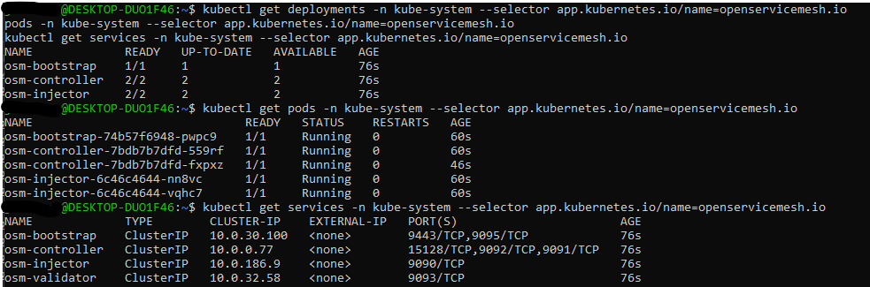
### Installing Prometheus via helm chart kube-prometheus-stack

* Execute the following

```
helm repo add prometheus-community https://prometheus-community.github.io/helm-charts
helm repo update
helm install prometheus \
prometheus-community/kube-prometheus-stack -f https://raw.githubusercontent.com/Azure/aks-advanced-autoscaling/module4/docs/module4/deploy/byo_values.yaml \
--namespace monitoring \
--create-namespace

```
* Check that everything is running

```
kubectl --namespace monitoring get pods -l "release=prometheus"

```
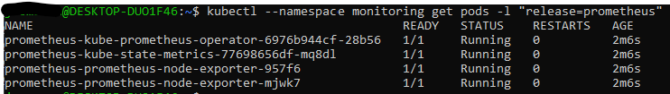

### Disabled metrics scapping from components that AKS don't expose.

* Execute the following

```
helm upgrade prometheus \
prometheus-community/kube-prometheus-stack -f https://raw.githubusercontent.com/Azure/aks-advanced-autoscaling/module4/docs/module4/deploy/byo_values.yaml \
--namespace monitoring \
--set kubeEtcd.enabled=false \
--set kubeControllerManager.enabled=false \
--set kubeScheduler.enabled=false

```

### In OSM CLI 

* Execute the following 

```
OSM_VERSION=v1.0.0
curl -sL "https://github.com/openservicemesh/osm/releases/download/$OSM_VERSION/osm-$OSM_VERSION-linux-amd64.tar.gz" | tar -vxzf -
sudo mv ./linux-amd64/osm /usr/local/bin/osm
sudo chmod +x /usr/local/bin/osm
sleep 10s
osm version --osm-namespace kube-system

```
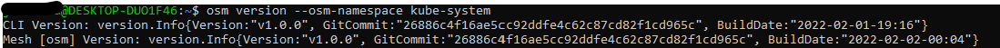
### Adding namespace to mesh and enabling OSM metrics

* Execute the following

```

osm namespace add order-portal order-processor
osm metrics enable --namespace "order-portal, order-processor"
sleep 5s
kubectl rollout restart deployment order-web -n order-portal
kubectl get pods -n <osm-mesh-namespace> -l app=osm-controller
kubectl get pods -n kube-system -l app=osm-controller

```
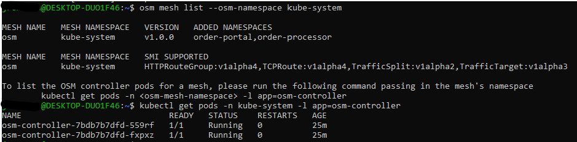
### Portforward Prometheus in another new terminal and open http://localhost:9090 :
```
nohup kubectl port-forward svc/prometheus-kube-prometheus-prometheus -n monitoring 9090 &
```

### Query to run in Prometheus to pull http metrics:
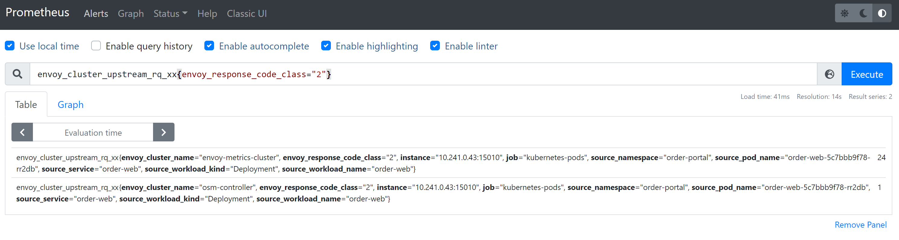
```
envoy_cluster_upstream_rq_xx{envoy_response_code_class="2"}

```

### Installing Contour in AKS:

[reference](https://projectcontour.io/getting-started/#option-2-helm)
```
helm repo add bitnami https://charts.bitnami.com/bitnami
helm repo update
helm install mycontour bitnami/contour --namespace projectcontour --create-namespace
sleep 10s
kubectl -n projectcontour get po,svc

```
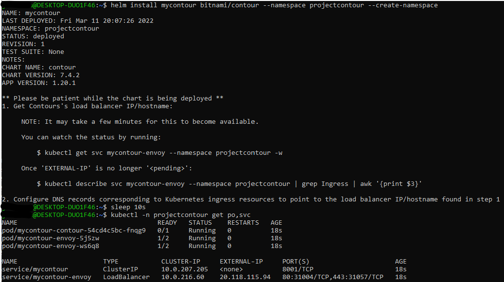
### Create HTTPProxy and ingressBackend for Order-web application
#### Get the public/External IP of the Azure loadbalancer created for the Contour Services
```
dns=".nip.io"
myip="$(kubectl -n projectcontour describe svc -l app.kubernetes.io/component=envoy | grep -w "LoadBalancer Ingress:"| sed 's/\(\([^[:blank:]]*\)[[:blank:]]*\)*/\2/')"
myip_dns=$myip$dns

```
#### Create HTTPProxy and ingressBackend
```
kubectl apply -f - <<EOF
apiVersion: projectcontour.io/v1
kind: HTTPProxy
metadata:
  name: orderportalproxy
  namespace: order-portal
spec:
  virtualhost:
    fqdn: $myip_dns
  routes:
  - services:
    - name: kedasampleweb
      port: 80
---
kind: IngressBackend
apiVersion: policy.openservicemesh.io/v1alpha1
metadata:
  name: orderportalbackend
  namespace: order-portal
spec:
  backends:
  - name: kedasampleweb
    port:
      number: 80 # targetPort of httpbin service
      protocol: http
  sources:
  - kind: Service
    namespace: projectcontour
    name: mycontour-envoy
EOF

sleep 5s
kubectl get httpproxy,ingressbackend -n order-portal

```
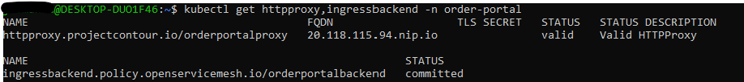
### Create KEDA ScaledObject based on Query

```
kubectl apply -f https://raw.githubusercontent.com/Azure/aks-advanced-autoscaling/module4/docs/module4/deploy/keda_order_http.yaml
```

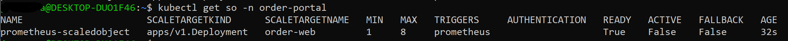
### Watch the pods been created:

```
kubectl get pods -n order-portal -w
```
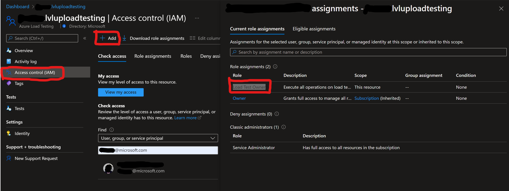

### Now navigate to your Azure Load Testing and add RBAC role of "Load Test Owner" to yourself:


### Create a new test with the file below:

* Download this file and in line 40 replace the "your-ip-dns" with the value of your env. variable $myip_dns 
[jmxloadtest](deploy/LvLUpAutoscalingLoadTest.jmx)
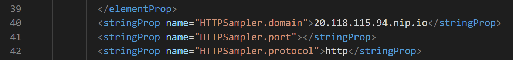

* Now navigate to your Azure Load Testing and hit Create under "Create a new test". Next name the load test and click on the tab "Test Tab" to upload your jmx file:
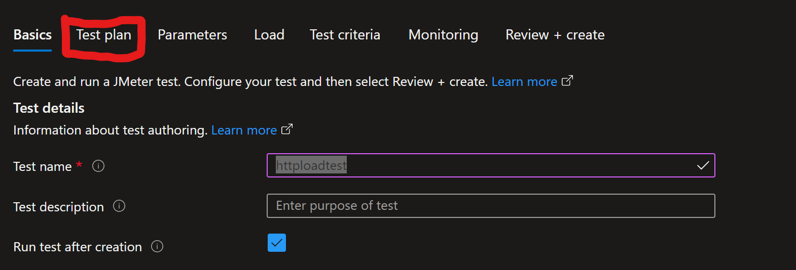

* Next hit the "Test criteria" and add the "Response time" and "Error" metrics like the photo below:
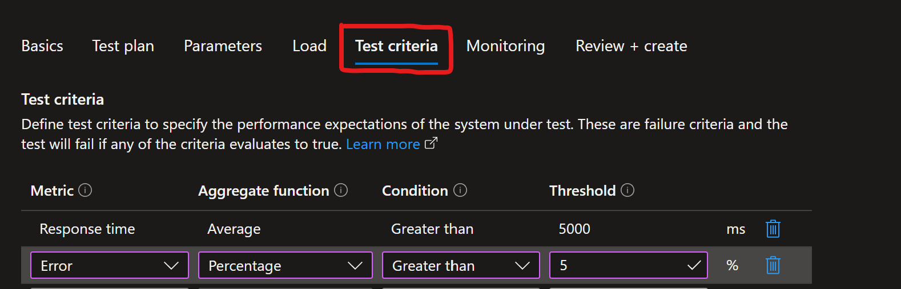

* Now hit "Review + create"

### Watch the metrics and the terminal with the pods
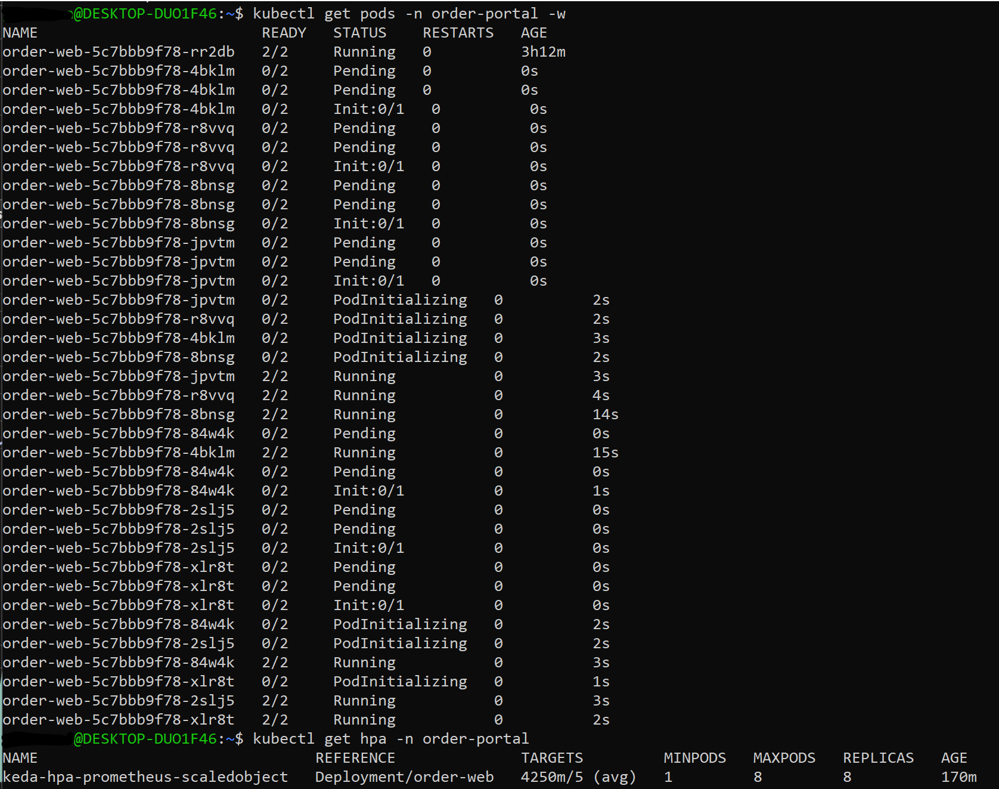
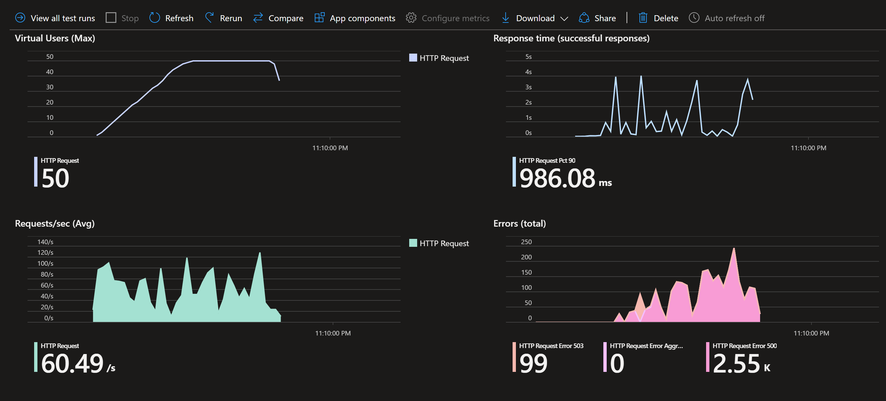
