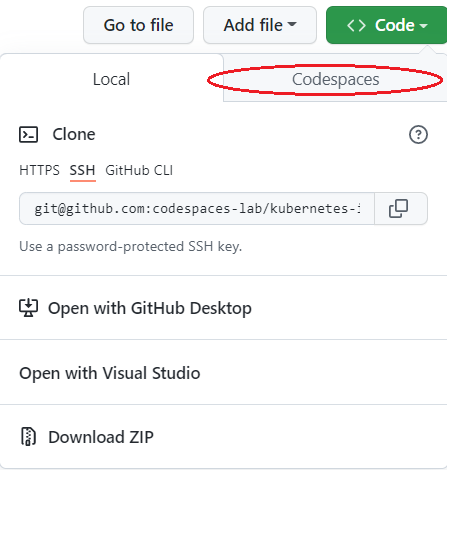

# Module 0 - PreRequisites

## Running the Labs in Github Codespace

- Click the `Code` button on this repo
  - Select `Codespaces` tab

  
  - If you don't see `Codespaces` tab, you will need to first [link your Microsoft alias to your GitHub account](https://docs.opensource.microsoft.com/github/accounts/linking/) 

- Click `New codespace`
- Choose the `4 core` option
- Log in to Azure from a bash or zsh terminal via: `az login --use-device-code`
- Proceed to [Module1!](../Module1/index.md)

