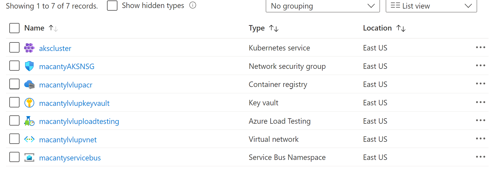
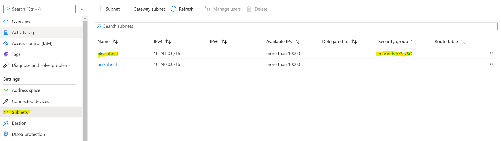
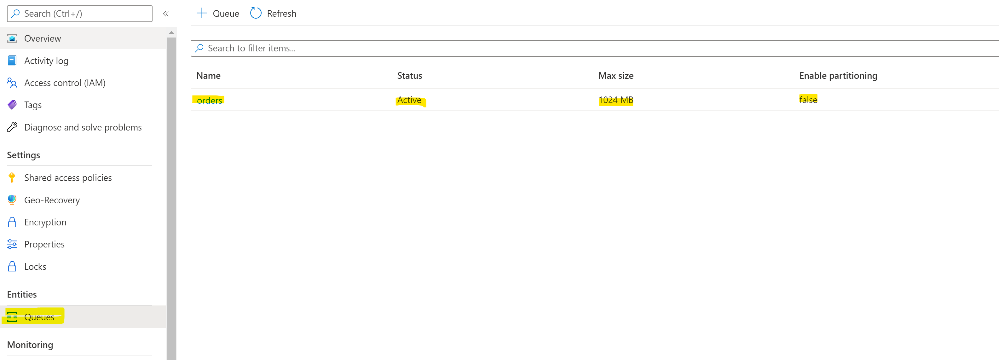
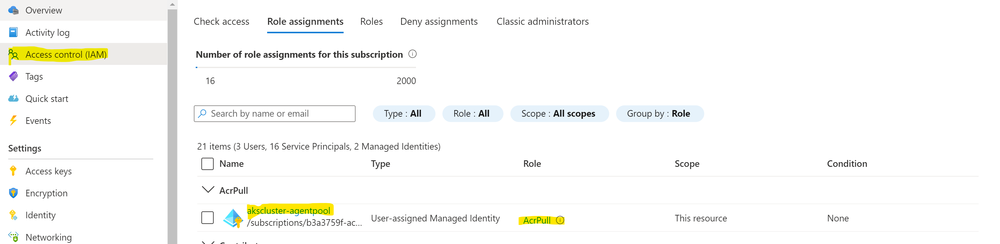

# Module 1 - Deploying AKS and Azure Services

## Deploy Infrastructure

To deploy the infrastructure for this workshop you can choose from one of the two options below.  This will deploy your resources into a single resource group.  Once the lab is complete, you can clean up the resources by deleting the resource group that is created upon deployment.

Use the following parameter references when deploying infrastructure:

#### Parameters Reference

Parameter Name | Description 
-------------- | ----------- 
 rgname | this parameter is the name of the resource group - the template is a subscription scope which deploys a resource group with all of the necessary resources 
 alias | this parameter is used to create a unique name for your resources and dns prefix for your aks cluster 
 aksversion | this parameter is for you to provide what version of kubernetes is installed on the cluster 
 location | this parameter is the azure datacenter that the resource group and resources will be created in - with the exception of the azure load testing resource which is further limited.  the allowed values for this parameter are datacenters that support aks 
 loadTestingLocation | the datacenter for load testing - allowed values are datacenters that support the load testing resource 

### Option 1 - Deploy using button

Click this button and provide the parameters in the portal - see parameters below for an explanation of the template parameters

#### About the button
    In order to create a Deploy to Azure button, you create a link to https://portal.azure.com/#create/Microsoft.Template/uri/<html encoded url to the file you wan to deploy>
    because .bicep files are currently not supported for remote deployment you must build your bicep file (transpose it into json) using the bicep CLI - bicep build <filename> which will output a monolithic JSON ARM template. 
    this is the file that is linked to in the button above
    if you were to add resources to the bicep file, you would then need to run bicep build on the file and replace the deployrg.json file with the newly built one
        
* this would require you to have the bicep cli installed on your machine [Install bicep tools](https://docs.microsoft.com/en-us/azure/azure-resource-manager/bicep/install)

### Option 2 - Deploy using CLI
You can [clone the repository](https://docs.github.com/en/repositories/creating-and-managing-repositories/cloning-a-repository) and use az powershell or az cli to deploy the bicep template from your local machine.
you must have the proper cli and or powershell 
[Install Azure CLI](https://docs.microsoft.com/en-us/azure/azure-resource-manager/bicep/install#azure-cli)
[Install Azure Powershell](https://docs.microsoft.com/en-us/azure/azure-resource-manager/bicep/install#azure-powershell)

## Check Deployment

Visit the new resource group that was created in the deployment and ensure that the following resources are deployed - 

The following table lists the resources that should be created: 
Resource Type | Resource Name 
--------------|--------------
Kubernetes Service | akscluster 
Nework Security Group | \<alias>AKSNSG
Container Registry | \<alias>lvlupacr
Key Vault | \<alias>lvlupkeyvault
Azure Load Testing | \<alias>lvluploadtesting
Virtual Network | \<alias>lvlupvnet
Service Bus Namespace | \<alias>servicebus

Click on the link for the virtual network, and then click on subnets from the left hand navigation.  Ensure there are 2 subnets listed, one called aksSubnet and a second one called aciSubnet Look for \<alias>AKSNSG resource to be associated to the aksSubnet. note: the aciSubnet will likely also have an associated NSG that is created by policy if deploying to a corporate subscription - 

Click on the link for the security group and make sure that there is an inbound rule with priority 1000 to allow http such as - 

Go back to the resource group, click on the Service Bus resource, and choose Queues from the left hand navigation.  Ensure there is a queue named orders such as - 

Finally, go back to the resource group, click on the Azure Container Registry resource, on the left hand navigation, choose Access control (IAM) - choose the Role assignments tab from the top context menu, and check that your akscluster-agentpool has been given AcrPull permissions to the container registry -

# Clean up

To clean up these resources, simply delete the single resource group that is created by the deployment.