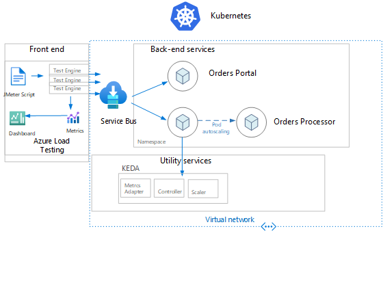
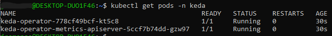
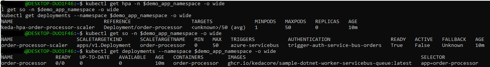

# Module 2: Application Deployment and Testing with Azure Load Testing
In this module you will learn how KEDA allows for fine-grained autoscaling (including to/from zero) for event driven Kubernetes workloads. KEDA serves as a Kubernetes Metrics Server and allows users to define autoscaling rules using a dedicated Kubernetes custom resource definition.  We will use Azure Load Test to generate a high load on the system so that pods will scale.


The output of this lab be this diagram:



### Install KEDA

First, let's setup our variables by copying the following lines of code in a code editor of your choice and modifying the values according to your enviroment:

```
### BEGIN - SETTING VARIABLES

#### Note: if your value set contains spaces please enclose the value in double quotes.

rg_name=[name of resource group as created in module 1]
servicebus_namespace=[servicebus namespace as created in Module 1]

### END - SETTING VARIABLES
```

Deploying KEDA with Helm is very simple.

Add Helm repo and connect to your AKS cluster:

```
## [aks as created in Module 1 - no need to change]
akscluster_name=akscluster 
az aks get-credentials --admin -g $rg_name --name $akscluster_name

helm repo add kedacore https://kedacore.github.io/charts
```
Update Helm repo:
```
helm repo update


```
Install KEDA Helm chart to your AKS Cluster:
```
kubectl create namespace keda
helm install keda kedacore/keda --namespace keda
```

Check to make sure KEDA is running successfully:
```
kubectl get pods -n keda
```



### Create the Authorization Rules for the Service Bus and Kubernetes secrets
The follow commands will allow you to set authorization rules for Azure Service Bus that will be used by the components in this module. It will also create Kubernetes secrets that reference the Authorization rules.

```
## [queue_name as created in Module 1 - no need to modify] 
queue_name=orders

authorization_rule_name=order-consumer
az servicebus queue authorization-rule create -g $rg_name --namespace-name $servicebus_namespace --queue-name $queue_name --name $authorization_rule_name --rights Listen

queue_connection_string=$(az servicebus queue authorization-rule keys list -g $rg_name --namespace-name $servicebus_namespace --queue-name $queue_name --name $authorization_rule_name --query primaryConnectionString -o tsv)

demo_app_namespace=order-processor
kubectl create namespace $demo_app_namespace

monitor_authorization_rule_name=order-monitor
az servicebus queue authorization-rule create -g $rg_name --namespace-name $servicebus_namespace --queue-name $queue_name --name $monitor_authorization_rule_name --rights Manage Send Listen

monitor_connection_string=$(az servicebus queue authorization-rule keys list -g $rg_name --namespace-name $servicebus_namespace --queue-name $queue_name --name $monitor_authorization_rule_name --query primaryConnectionString -o tsv)

keda_servicebus_secret=keda-servicebus-secret
kubectl create secret generic $keda_servicebus_secret --from-literal=keda-connection-string=$monitor_connection_string -n $demo_app_namespace

kubectl create secret generic order-consumer-secret --from-literal=queue-connection-string=$queue_connection_string -n $demo_app_namespace

demo_web_namespace=order-portal
kubectl create namespace $demo_web_namespace

kubectl create secret generic order-consumer-secret --from-literal=queue-connection-string=$monitor_connection_string -n $demo_web_namespace

```

### Deploying order processor app and KEDA scaledobject
 The KEDA ScaledObject is a custom resource definition which is used to define how KEDA should scale your application and what the triggers are.

 If you have  cloned the repository, you can use the following commands to deploy the app from your local file path.

In the CLI, please set the directory by running the following with your file path:

"cd [file path to root of cloned repository]"


```
kubectl apply -f tools/deploy/module2/deploy-app.yaml --namespace $demo_app_namespace

kubectl apply -f tools/deploy/module2/deploy-autoscaling.yaml --namespace $demo_app_namespace
```


Take a look at the HPA state and ScaledObject before proceeding to the next step:
```
kubectl get hpa -n $demo_app_namespace -o wide
kubectl get so -n $demo_app_namespace -o wide
kubectl get deployments --namespace $demo_app_namespace -o wide

```


You can look at the details of Keda ScaledObject deployment by running the following:

```

kubectl describe scaledobject order-processor-scaler -n $demo_app_namespace

```

### Deploying web order portal application to order-portal namespace

```
kubectl apply -f tools/deploy/module2/deploy-web.yaml --namespace $demo_web_namespace

```

#### Create Service Bus Authorization rule for Azure Load Testing


```

monitor_authorization_rule_name=alt-send
az servicebus queue authorization-rule create -g $rg_name --namespace-name $servicebus_namespace --queue-name $queue_name --name $monitor_authorization_rule_name --rights Listen Send

asb_connectionstring4alt=$(az servicebus queue authorization-rule keys list -g $rg_name --namespace-name $servicebus_namespace --queue-name $queue_name --name $monitor_authorization_rule_name --query primaryConnectionString -o tsv)

echo $asb_connectionstring4alt 
```
#### Watching the pods scale

* Open new bash shell: run the following `watch kubectl get pod -n order-processor`
* We will monitor this terminal at the end of module2 to observe the scaling events.

### Create Azure Load Testing resources (Test, Secrets, Test settings)

> Note: the entire sequence of commands is also included in ["Option 1 - ALT Creation.sh script"](https://github.com/Azure/aks-advanced-autoscaling/tree/main/tools/deploy/module2/Option%201%20-%20ALT%20Creation.sh)

First, let's setup our variables by copying the following lines of code in a code editor of your choice and modifying the values according to your enviroment:

```
## Note: if your value set contains spaces please enclose the value in double quotes.
## Also, please make sure to run the following commands from same command directory as the location of LvLUpAutoscalingLoadTest.jmx in order to let the "-F file=" parameter load the jmx content correctly (use cd to set your command directory)

### BEGIN - SETTING ALL VARIABLES

subscription=[your subscription id used in Module 1]
rg_name=[name of resource group created in Module 1]
servicebus_namespace=[name of your azure service bus namespace]  
azure_key_vault=[your azure key vault name created in Module 1]
alt=[your azure load testing instance name created in Module 1]
## set the value of the azure service bus endpoint uri - typically this is "asbnamespace.servicebus.windows.net"
asb_endpoint_uri=[your asb uri]

### END - SETTING ALL VARIABLES
```

*Reusing the same shell to run the commands until the end of this module will allow you to keep the values of the variables in memory. It is suggested to keep running all the commands of this module in the same shell where possible.*

The following commands will let you create an Azure Service Bus SAS token (with 8 hours lifetime) that will be stored in a secret in Azure Key Vault. The secret will be used by the Azure Load Testing test instance to connect to Azure Service Bus. 

Please copy, paste and run the following commands in a shell:

```
# Unless you are already logged in, 'az login'  will open a browser window to let you authenticate. Once authenticated, the script will continue running 
#az login
az account set -s $subscription 
asb_queue=orders 
asb_queue_key_name=alt-send

asb_uri="https://"$servicebus_namespace".servicebus.windows.net/"$asb_queue"/messages"
asb_queue_primary_key=$(az servicebus queue authorization-rule keys list -g $rg_name --namespace-name $servicebus_namespace --queue-name $asb_queue --name $asb_queue_key_name --query primaryKey -o tsv)

echo $asb_queue_primary_key

# Function to build a valid SAS token. Reference: https://docs.microsoft.com/en-us/rest/api/eventhub/generate-sas-token
get_sas_token() {
    local ASB_URI=$1
    local SHARED_ACCESS_KEY_NAME=$2
    local SHARED_ACCESS_KEY=$3
    local EXPIRY=${EXPIRY:=$((60 * 60 * 8))} # Setting default token expiration at 8 hours

    local ENCODED_URI=$(echo -n $ASB_URI | jq -s -R -r @uri)
    local TTL=$(($(date +%s) + $EXPIRY))
    local UTF8_SIGNATURE=$(printf "%s\n%s" $ENCODED_URI $TTL | iconv -t UTF-8)

    local HASH=$(echo -n "$UTF8_SIGNATURE" | openssl sha256 -hmac $SHARED_ACCESS_KEY -binary | base64)
    local ENCODED_HASH=$(echo -n $HASH | jq -s -R -r @uri)

    echo -n "SharedAccessSignature sr=$ENCODED_URI&sig=$ENCODED_HASH&se=$TTL&skn=$SHARED_ACCESS_KEY_NAME"
}

sastoken=$(get_sas_token $asb_uri $asb_queue_key_name $asb_queue_primary_key)
secretvalue=$sastoken
secret_name="sastoken"

## get current user upn
upn=$(az ad signed-in-user show --query userPrincipalName -o tsv)
## add access policy for current user to azure key vault
az keyvault set-policy -g $rg_name -n $azure_key_vault --secret-permissions all --upn $upn

# this will set the secret expiration in 8 hours from current date/time
expiredate=$(date +%Y-%m-%d'T'%H:%M:%S'Z' -d "$(date) + 8 hours")

az keyvault secret set --name $secret_name --vault-name $azure_key_vault --value "$secretvalue" --subscription $subscription --expires "$expiredate"

secret_uri=$(az keyvault secret show --name $secret_name --vault-name $azure_key_vault --query id -o tsv)

```

Before proceeding with the next steps, we need to set your role assignment as "Load Test Owner" to the Azure Load Testing resource. The instructions on how you can execute this operation from the portal are documented here https://docs.microsoft.com/en-us/azure/load-testing/how-to-assign-roles#manage-resource-access. Anyhow, we will execute this operation via script to make it easier and faster. 

Please copy, paste and run the following commands in a shell:

```
## The following line is only necessary for Git Bash shell
export MSYS_NO_PATHCONV=1

## Let's retrieve your AAD objectId from current session user information
objectId=$(az ad signed-in-user show --query "objectId" -o tsv)

## Let's set the scope that will see the role assigned
altscope="/subscriptions/$subscription/resourceGroups/$rg_name/providers/Microsoft.LoadTestService/loadtests/$alt"

role="Load Test Owner"

az role assignment create --assignee $objectId --role "$role" --scope $altscope


```

The following commands will let you create an Azure Load Testing Test instance that will contain the minimal structure of the test execution. We will update the structure later on in this module.

Please copy, paste and run the following commands in a shell:

```
## Default value already set for the load test instance that we are going to create. Feel free to keep it as-is or modify
testname="LvlUpNewTest"

## Values are already set. No need to change. Modify only if you would like to use different ones. 
testdate=$(date)
testdescription="Level Up Azure Load Testing Instance - Created on: $testdate"

## constant values - do not change unless instructed by trainer
arm_apiversion="api-version=2021-12-01-preview"
alt_apiversion="api-version=2021-07-01-preview"

## formatting resourceId string based on submitted variables 
resourceId="/subscriptions/"$subscription"/resourcegroups/"$rg_name"/providers/microsoft.loadtestservice/loadtests/"$alt

## formatting management endpoint url based on submitted variables 
armEndpoint="https://management.azure.com"$resourceId"?$arm_apiversion"

accessToken=$(az account get-access-token --resource "https://management.core.windows.net" --query accessToken -o tsv) 

hdr_authorization="Authorization: Bearer $accessToken"
hdr_content_type="Content-Type: application/json"

dataPlaneURI=$(curl -G -H "$hdr_authorization" -H "$hdr_content_type" $armEndpoint | jq -r .properties.dataPlaneURI) 

# utility function to create random guid
uuid()
{
    local N B C='89ab'

    for (( N=0; N < 16; ++N ))
    do
        B=$(( $RANDOM%256 ))

        case $N in
            6)
                printf '4%x' $(( B%16 ))
                ;;
            8)
                printf '%c%x' ${C:$RANDOM%${#C}:1} $(( B%16 ))
                ;;
            3 | 5 | 7 | 9)
                printf '%02x-' $B
                ;;
            *)
                printf '%02x' $B
                ;;
        esac
    done

    echo
}

testId=$(uuid) # do not change

# get access token for Azure Load Testing API endpoint
accessToken=$(az account get-access-token --resource "https://loadtest.azure-dev.com" --query accessToken -o tsv) 

## Number of Instances to run the test
EngineInstancesCount=1

## random id for the metrics - no need to change 
passFailMetrics1Guid=$(uuid) 
passFailMetrics2Guid=$(uuid) 

#
testJson=$(cat <<EOF
{
    "resourceId": "$resourceId",
    "testId": "$testId",
    "description": "$testdescription",
    "displayName": "$testname",
    "loadTestConfig": {
        "engineSize": "m",
        "engineInstances": $EngineInstancesCount
    },
    "secrets": {
        "sastoken": {
        "value": "$secret_uri",
        "type": "AKV_SECRET_URI"
        }
    },
    "environmentVariables": {
        "endpoint_uri": "$asb_endpoint_uri"
    },
    "passFailCriteria": {
        "passFailMetrics": {
            "$passFailMetrics1Guid": {
                "clientmetric": "response_time_ms",
                "aggregate": "avg",
                "condition": ">",
                "value": 500,
                "action": "continue",
                "result": null,
                "actualValue": 0
            },
            "$passFailMetrics2Guid": {
                "clientmetric": "error",
                "aggregate": "percentage",
                "condition": ">",
                "value": 30,
                "action": "continue",
                "result": null,
                "actualValue": 0
            }
        }
    }
}
EOF
)

hdr_authorization="Authorization: Bearer $accessToken"
hdr_content_type="Content-Type: application/merge-patch+json"

## set the Create Load Test API Endpoint URI 
loadCreateTestURI="https://"$dataPlaneURI"/loadtests/"$testId"?$alt_apiversion"
loadCreateTestResponse=$(curl $loadCreateTestURI -X PATCH -H "$hdr_authorization" -H "$hdr_content_type" -d "$testJson")

echo "****** Begin - Create Test API Response"
echo $loadCreateTestResponse
echo "****** End - Create Test API Response"

```

The previous sequence of commands should result in a json string in the output. The json string will contain the properties of the Test instance just created. 
The presence of the test properties in the output (you should see no errors nor *null* values) would confirm that the test instance has been created successfully.

We are now going to upload the jmx/jmeter file to the test instance. The file contains the logic and parameters of the test.

Please copy, paste and run the following commands in a shell:

```

## Let's wait for the creation of the Test to be completed
sleep 5

fileid=$(uuid)
hdr_authorization="Authorization: Bearer $accessToken"
validateUploadFileTestURI="https://$dataPlaneURI/file/$fileid:validate?"$alt_apiversion
validateUploadFileTestResponse=$(curl $validateUploadFileTestURI -w "%{http_code}" -H "$hdr_authorization" -F "file=@tools/deploy/module2/LvLUpAutoscalingLoadTest.jmx")

## Now we will upload the jmx to the test with the next sequence of commands
uploadFileTestURI="https://$dataPlaneURI/loadtests/$testId/files/$fileid?"$alt_apiversion

## Please make sure to run the following from same command directory as the location of LvLUpAutoscalingLoadTest.jmx 
## in order to let the -F file= parameter load the jmx content correctly

uploadFileTestURIResponse=$(curl $uploadFileTestURI -X PUT -w "%{http_code}" -H "$hdr_authorization" -F "file=@LvLUpAutoscalingLoadTest.jmx")

### END - SCRIPT EXECUTION

```
Feel free to perform some final checks with the following commands:
```
### BEGIN - SOME FINAL CHECKS

## Let's verify that we got a http code 200 = OK for the Test File upload validation
RESPONSE_200_OK="200"
if [[ "$validateUploadFileTestResponse" == *"$RESPONSE_200_OK"* ]]

then 
    echo -e "\n\n*** STATUS OK *** :-) --> File ID is available  OK to continue"
else
    echo -e "\n\n*** IMPORTANT *** :'-( ***: File ID validation failed - Stop Executing any further and verify the error"
    echo -e "Status: "$validateUploadFileTestResponse
fi

## Let's verify that we got a http code 201 = OK for the Test creation
RESPONSE_201_OK="201"
if [[ "$uploadFileTestURIResponse" == *"$RESPONSE_201_OK"* ]]
then 
    echo -e "\n\n*** STATUS OK *** :-) --> Jmx File Uploaded - OK to continue"
else
    echo -e "\n\n*** IMPORTANT *** :'-( ***: Jmx File Not Uploaded - Stop Executing any further and verify the error"
    echo -e "Status: "$uploadFileTestURIResponse
fi


### END - SOME FINAL CHECKS
```
If the commands did run correctly you should see in the portal a Test configuration like this:


Click on the Test instance shown on the list ("LvlUpNewTest") to configure or review the instance:


At this point, you should be ready to run the test and watch the pods scaling as previously explained: 
1. From bash/sh shell please execute **"watch kubectl get pod -n order-processor"**.
2. From Azure Portal (Azure Load Testing->Tests->Your Test), please run the test using one of the "Run" buttons as shown in the image below: 


> Note: the portal may show a panel on the right of the screen to confirm the parameters. Since the parameters are already set, please feel free to click "Run" and start the Test.

