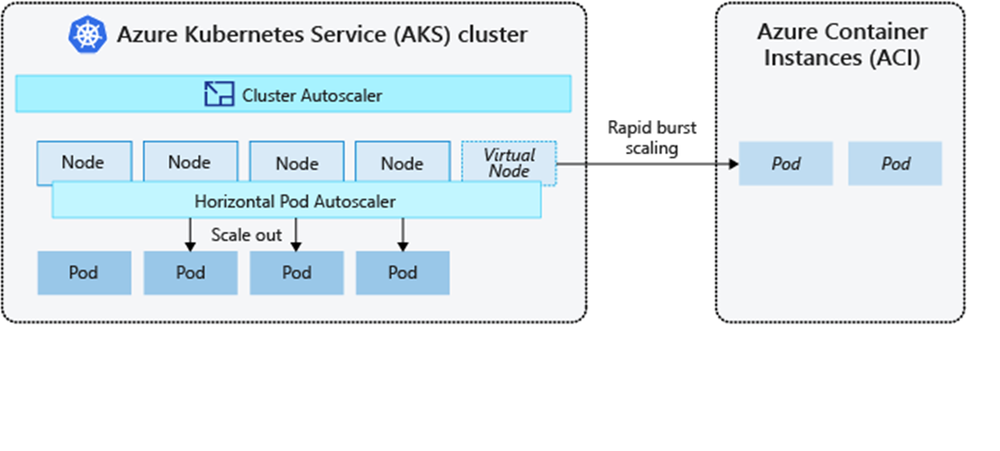

# Burst Scaling with Azure Container Instances (ACI) / Virtual Nodes

**Architecture Diagram**



**ACI Benefits**

* Rapidly scale your AKS cluster
* Pay per second
* No additional infrastructure overhead
* Application requires no modification to use virtual nodes
* Keda integration - Scaling in virtual nodes automatically to zero, when pods no longer needed

**ACI Limitations**

* Virtual nodes only work with AKS clusters created using advanced networking (Azure CNI)
* Linux pods only
* DaemonSets will not deploy pods to the virtual nodes
* Using service principal to pull ACR images

## Pod Spec for ACI Deployment
**Only on ACI**

```yaml
tolerations:
      - key: virtual-kubelet.io/provider
        operator: Exists
      - key: azure.com/aci
        effect: NoSchedule
nodeSelector:
        kubernetes.io/role: agent
        beta.kubernetes.io/os: linux
        type: virtual-kubelet
```

**On ACI after using VM’s**

```yaml
tolerations:
      - key: virtual-kubelet.io/provider
        operator: Exists
      - key: azure.com/aci
        effect: NoSchedule
affinity:
    nodeAffinity:
      preferredDuringSchedulingIgnoredDuringExecution:
      - weight: 1
        preference:
          matchExpressions:
          - key: type
            operator: NotIn
            values:
            - virtual-kubelet
```

## Module 3 Lab Instructions

[INSTRUCTIONS](part2.md)
