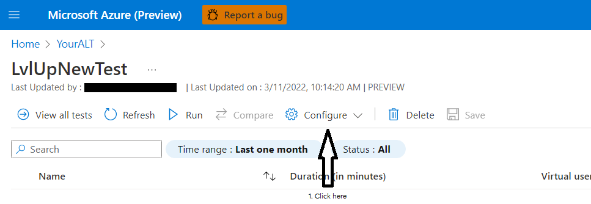
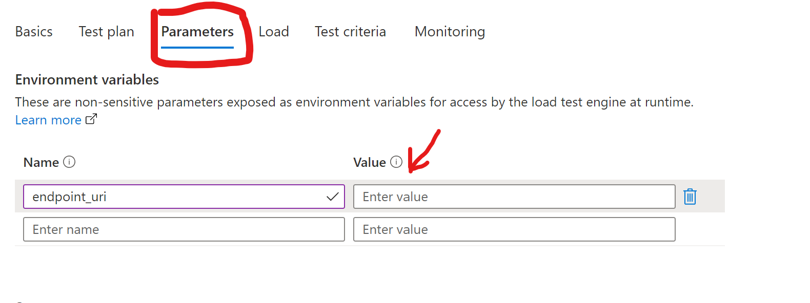

# Module 4: Configure Keda Using Http Metrics & Open Service Mesh and Testing with Azure Load Testing
In this module you will learn about using Open Service Mesh, Prometheus and Contour Ingress Controller. How to collect with Prometheus OSM traffic metrics within the mesh(http requests) and query/use these metrics to autoscale a particular app/pod using KEDA and a [prometheus](https://keda.sh/docs/2.6/scalers/prometheus/) Scale Object. You will also use Contour Ingress Controller as part of you mesh in order to have full observability of all type of traffic, East-West(app to app) and North-South(Ingress to web). At the end your web-order app will be able to autoscale based on http requests rate per minute. 
* Below is a diagram:
 

### Intro to OpenServiceMesh
OpenServiceMesh is a simple, complete, and standalone service mesh that ships out-of-the-box with all necessary components to deploy a complete service mesh. 

Use Cases:
 - Apply policies governing traffic access between peer applications
 - Encrypt traffic between applications leveraging mTLS and short-lived certificates with a custom CA
 - Collect traces and metrics to provide visibility into the health and operation of the services
 - Implement traffic split between various versions of the services deployed as defined via SMI Spec
 - Enforce "policy as code" with Open Policy Agent authentication plugin

### Install OpenServiceMesh

* Execute the following
```
az aks enable-addons --addons open-service-mesh -g $rg_name -n $akscluster_name
```
* Verify it was enabled
```
az aks show -g $rg_name -n $akscluster_name --query 'addonProfiles.openServiceMesh.enabled'
```

### Verify the status of OSM in kube-system namespace

* Execute the following

```
kubectl get deployments -n kube-system --selector app.kubernetes.io/name=openservicemesh.io
kubectl get pods -n kube-system --selector app.kubernetes.io/name=openservicemesh.io
kubectl get services -n kube-system --selector app.kubernetes.io/name=openservicemesh.io

```


### Bring your own Prometheus via helm and chart kube-prometheus-stack

* In order to react as fast as possible to http metrics collected by the OSM we have decided to use Prometheus due to the low latency requirement and the Scalers provided in KEDA. However is important to understand that you have to ingrated a new or existing prometheus deployment in the case of using AKS and not use the OSM cli build-in deployment.  

### Installing Prometheus via helm chart kube-prometheus-stack

* Execute the following

```
helm repo add prometheus-community https://prometheus-community.github.io/helm-charts
helm repo update
helm install prometheus \

prometheus-community/kube-prometheus-stack -f https://raw.githubusercontent.com/Azure/aks-advanced-autoscaling/main/tools/deploy/module4/byo_values.yaml \

--namespace monitoring \
--create-namespace

```
* Check that everything is running

```
kubectl --namespace monitoring get pods -l "release=prometheus"

```


### Disabled metrics scapping from components that AKS don't expose.

* Execute the following

```
helm upgrade prometheus \

prometheus-community/kube-prometheus-stack -f https://raw.githubusercontent.com/Azure/aks-advanced-autoscaling/main/tools/deploy/module4/byo_values.yaml \

--namespace monitoring \
--set kubeEtcd.enabled=false \
--set kubeControllerManager.enabled=false \
--set kubeScheduler.enabled=false

```

### In OSM CLI 

* Execute the following 

```
OSM_VERSION=v1.0.0
curl -sL "https://github.com/openservicemesh/osm/releases/download/$OSM_VERSION/osm-$OSM_VERSION-linux-amd64.tar.gz" | tar -vxzf -
sudo mv ./linux-amd64/osm /usr/local/bin/osm
sudo chmod +x /usr/local/bin/osm
sleep 10s
osm version --osm-namespace kube-system

```


### Intro to OSM observability and Metrics scraping
Open Service Mesh (OSM) generates detailed metrics related to all traffic within the mesh and the OSM control plane. These metrics provide insights into the behavior of applications in the mesh and the mesh itself helping users to troubleshoot, maintain and analyze their applications. OSM collects metrics directly from the sidecar proxies (Envoy). With these metrics the user can get information about the overall volume of traffic, errors within traffic and the response time for requests. Additionally, OSM generates metrics for the control plane components. These metrics can be used to monitor the behavior and health of the service mesh. OSM uses Prometheus to gather and store consistent traffic metrics and statistics for all applications running in the mesh. Each application that is part of the mesh runs in a Pod which contains an Envoy sidecar that exposes metrics (proxy metrics) in the Prometheus format. Furthermore, every Pod that is a part of the mesh and in a namespace with metrics enabled has Prometheus annotations, which makes it possible for the Prometheus server to scrape the application dynamically. This mechanism automatically enables scraping of metrics whenever a pod is added to the mesh.

For metrics to be scraped, the following prerequisites must be met:
- The namespace must be a part of the mesh, ie. it must be labeled with the openservicemesh.io/monitored-by label with an appropriate mesh name. This can be done using the `osm namespace add command`
- A running service able to scrape Prometheus endpoints. OSM provides configuration for an automatic bringup of Prometheus; alternatively users can bring their own Prometheus which is our current case.

### Adding namespace to mesh and enabling OSM metrics

* Execute the following

```

osm namespace add order-portal order-processor
osm metrics enable --namespace "order-portal, order-processor"
sleep 5s
kubectl rollout restart deployment order-web -n order-portal
kubectl get pods -n <osm-mesh-namespace> -l app=osm-controller
kubectl get pods -n kube-system -l app=osm-controller

```


### Portforward Prometheus in another new terminal and open http://localhost:9090 :
```
nohup kubectl port-forward svc/prometheus-kube-prometheus-prometheus -n monitoring 9090 &
```

### Query to run in Prometheus to pull http metrics:


```
envoy_cluster_upstream_rq_xx{envoy_response_code_class="2"}

```

### Installing Contour in AKS:

[reference](https://projectcontour.io/getting-started/#option-2-helm)
```
helm repo add bitnami https://charts.bitnami.com/bitnami
helm repo update
helm install mycontour bitnami/contour --namespace projectcontour --create-namespace
sleep 10s
kubectl -n projectcontour get po,svc

```


### Create HTTPProxy and ingressBackend for Order-web application
#### Get the public/External IP of the Azure loadbalancer created for the Contour Services
```
dns=".nip.io"
myip="$(kubectl -n projectcontour describe svc -l app.kubernetes.io/component=envoy | grep -w "LoadBalancer Ingress:"| sed 's/\(\([^[:blank:]]*\)[[:blank:]]*\)*/\2/')"
myip_dns=$myip$dns

```
#### Create HTTPProxy and ingressBackend
```
kubectl apply -f - <<EOF
apiVersion: projectcontour.io/v1
kind: HTTPProxy
metadata:
  name: orderportalproxy
  namespace: order-portal
spec:
  virtualhost:
    fqdn: $myip_dns
  routes:
  - services:
    - name: kedasampleweb
      port: 80
---
kind: IngressBackend
apiVersion: policy.openservicemesh.io/v1alpha1
metadata:
  name: orderportalbackend
  namespace: order-portal
spec:
  backends:
  - name: kedasampleweb
    port:
      number: 80 # targetPort of httpbin service
      protocol: http
  sources:
  - kind: Service
    namespace: projectcontour
    name: mycontour-envoy
EOF

sleep 5s
kubectl get httpproxy,ingressbackend -n order-portal

```


### Create KEDA ScaledObject based on Query

```
kubectl apply -f https://raw.githubusercontent.com/Azure/aks-advanced-autoscaling/main/tools/deploy/module4/keda_order_http.yaml
```


### For watching the pods been created:

```
kubectl get pods -n order-portal -w
```

### Now navigate to your Azure Load Testing instance and select the "Tests" blade 


### Select the existing Test and hit configure 



### Remove the existing test plan jmx file and upload the file below:
[jmxloadtest](../../../tools/deploy/module4/LvLUpAutoscalingLoadTest.jmx)


### Click on the Parameters tab and update the value of the endpoint_uri

* The value should be of your shell env. variable $myip_dns
* Alternative you can run `kubectl get httpproxy -n order-portal` and copy the FQDN 



* Optionally you could hit the "Test criteria" and add/modify the "Response time" and "Error" metrics like the photo below:


* Now hit "Apply and them re-run the test"

### Watch the metrics and the terminal with the pods


